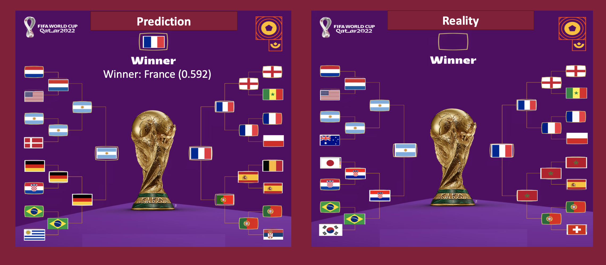

# Overview

The purpose of this project is to use data from international matches since the 1990s, as well as information about the teams' qualifications to predict the outcomes of the 2022 World Cup in Qatar.

# Dataset

The datasets was optained from:

1. <a href="https://www.kaggle.com/datasets/evangower/fifa-world-cup?select=wcmatches.csv">FIFA World Cup</a>

2. <a href="https://www.kaggle.com/datasets/brenda89/fifa-world-cup-2022">International soccer matches and team strengths (1993-2022)</a>

# Project Structure

1. Data Acquisition

2. Data Preparation and wrangling

3. Exploratory Data Analysis

4. Group stage/knockout modeling

5. Group stage/knockout prediction

# Modeling 

We train Machine learning models to predict the outcomes of World Cup matches. We use one model to predict the group stage matches, where the result can be a loss, draw, or win, and another model to predict the knockout stage, where the result is either a defeat or victory. Among the algorithms we tested, the XGBoost model performed the best in both stages. We have therefore fine-tuned and validated the XGBoost model, and exported it as a pipeline to perform the predictions.

# Referances

1. https://www.brendankent.com/blog/coding-for-sports-analytics-resources-to-get-started 

2. https://www.bigbookofr.com/sport-analytics.html 

3. https://www.robert-hickman.eu/post/dixon_coles_1/ 

